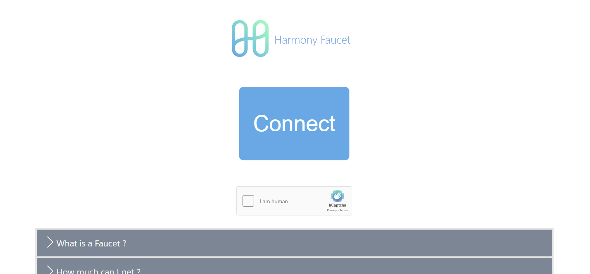

# Harmony mainnet faucet server/frontend

App available at https://harmony.supply soon

built upon: [polygon-faucet](https://github.com/TamtamHero/polygon-faucet) 

supports ONE transfers on Harmony mainnet

- payout frequency: 1800 seconds
- server check frequency: 10 seconds
- max amount on account to be able to claim: 0.01 ONE (same as payout)

(configured in `server/config.json`)

address and ip are 'greylisted' right after a successful transaction - for 60 seconds. greylists are reset every 10 seconds.



# installing

```
$ git clone https://github.com/dietbald/harmony-supply.git
$ cd harmony-supply && cd server && npm install
$ cd .. && cd frontend && npm install
$ cd ..
```

## Configuring the faucet API

edit ```config.json``` in the `server/` directory and add private keys to the accounts for each network.

Start your faucet:

```
node index.js
```

## Configuring the faucet frontend

edit the file `client/src/config.js` and specify the base URL for your API. Run `npm run start`

# API

## Endpoints

### ```GET https://<FAUCET-URL>/info```

#### Response
```
{
	checkfreqinsec: ...,
	greylistdurationinsec: ...,
	balances: [
		{
			"network": ...,
			"account": ...,
			"balanceEth": ...,
		},
		...
	]
}
```

### ```GET https://<FAUCET-URL>/harmony/one/:address/:captcha```


- #### Network Name
|name|RPC|
|---|---|
|`rpc-mainnet`|`https://api.harmony.one`|

- #### Harmony address
your Harmony address

#### Response format
Status code: 200
```
{ 
	hash: 0x2323... 
}
```
Status code: 500
```
{
	err: {
		...
	}
}
```
* `hash` transaction hash 

## Example Usage

`curl http://localhost:3000/0x96C42C56fdb78294F96B0cFa33c92bed7D75F96a`


## HTTP Return / error codes

* `200` : Request OK
* `400` : Invalid address
* `500` : error (greylisted/ tx error)
